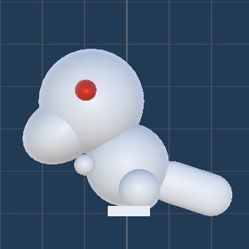

<div align="center">



# 🏛️ Project Museum

**3D 第三人称箱庭式动作解谜 ｜ 3D Third-Person Compact Action-Puzzle**

[](https://unity.com/)
[-blue)]()
[](https://xxxstar.itch.io/project-museum)

*一个练手用的 Unity 解谜游戏 Demo ｜ A practice Unity puzzle-game demo*

</div>

---

## 📖 项目简介 ｜ About

> **物品决定体型，体型决定能力。**
> *Items decide your size. Size decides your power.*

在一座封闭的小型博物馆中，玩家通过 **拾取不同物品** 在三种体型之间自由切换，利用各体型独特的能力来搬运、破坏、潜行，最终解开层层谜题通关。

In a compact museum, the player picks up different artifacts to **shift between three body sizes**, each granting unique abilities — carry, smash, or sneak — to solve layered puzzles.

<br/>

## 🎮 游戏特色 ｜ Features

| 🇨🇳                                  | 🇬🇧                                                     |
| ---------------------------------- | ----------------------------------------------------- |
| 箱庭式关卡，线性目标 + 回环式探索  | Compact level with linear goals + looping exploration |
| 拾取物品切换三种体型，解锁不同能力 | Pick up items to switch between 3 body sizes          |
| 物理冲撞 & 推挤恐龙战斗            | Physics-based charge & push combat vs. dinosaurs      |
| 缩小钻通风管、变大砸路障、钥匙开门 | Shrink through vents, grow to smash, keys to unlock   |
| 第三人称越肩自由视角               | Third-person over-the-shoulder free camera            |

<br/>

## 🕹️ 操作指南 ｜ Controls

| 操作 / Action                | 按键 / Key                              |
| :--------------------------- | :-------------------------------------- |
| 移动 / Move                  | `W` `A` `S` `D`                         |
| 旋转视角 / Rotate Camera     | 按住鼠标右键 + 拖拽 / Hold `RMB` + Drag |
| 拾取物品 / Pick Up           | `E`                                     |
| 放下物品 / Drop              | `Q`                                     |
| 使用物品（如开门）/ Use Item | 鼠标左键 / `LMB`                        |
| 暂停菜单 / Pause Menu        | `Esc`                                   |

<br/>

## 🔄 体型系统 ｜ Body-Size System

### 🧍 普通体型 Normal

|                    |                                                                                 |
| ------------------ | ------------------------------------------------------------------------------- |
| **触发 / Trigger** | 空手或手持普通道具（如钥匙）/ Empty-handed or holding a regular item (e.g. Key) |
| **能力 / Ability** | 标准移速，可使用功能道具 / Standard speed, can use functional items             |
| **限制 / Limit**   | 无法穿越狭缝，无法推动重物 / Cannot fit through gaps or push heavy objects      |

### 🐜 微缩体型 Small

|                    |                                                                          |
| ------------------ | ------------------------------------------------------------------------ |
| **触发 / Trigger** | 手持 **缩小宝珠** 🟡 Shrink Orb / Hold the **Shrink Orb** (yellow sphere) |
| **能力 / Ability** | 穿过通风管道和杂物缝隙 / Crawl through vents and debris gaps             |
| **限制 / Limit**   | 无法攻击，无法开门 / Cannot attack or open doors                         |

### 🦖 巨人体型 Giant

|                    |                                                                                                       |
| ------------------ | ----------------------------------------------------------------------------------------------------- |
| **触发 / Trigger** | 手持 **巨人雕像** 🔴 Mega Statue / Hold the **Mega Statue** (red model + white base)                   |
| **能力 / Ability** | 冲撞破坏障碍物，物理推挤恐龙，免疫击退 / Charge to destroy barriers, push dinosaurs, knockback-immune |
| **限制 / Limit**   | 无法通过普通门，行动消耗耐力 / Cannot pass normal doors, actions cost stamina                         |

<br/>

## ⚔️ 战斗机制 ｜ Combat

| 🇨🇳                                        | 🇬🇧                                                              |
| ---------------------------------------- | -------------------------------------------------------------- |
| **敌人**：复活的恐龙（白色简易模型）     | **Enemy**: Revived dinosaurs (white placeholder model)         |
| 三种状态：🟢 游荡 → 🟡 眩晕 → 🔵 归位       | Three states: 🟢 Roaming → 🟡 Stunned → 🔵 Returned               |
| 普通 / 微缩形态只能躲避                  | Normal / Small can only evade                                  |
| **巨人形态**冲撞使恐龙眩晕，然后推回展台 | **Giant** charges to stun, then pushes dino back onto pedestal |

<br/>

## 🧩 解谜概览 ｜ Puzzle Overview

```
🐜  缩小钻入封闭区域        ➜  Shrink to crawl into sealed areas
🧍  用钥匙打开上锁的门      ➜  Use keys to unlock doors
🦖  变大砸毁路障，打通捷径  ➜  Grow giant to smash barricades & open shortcuts
```

<br/>

## 🛠️ 技术栈 ｜ Tech Stack

|                                |                                                                                                                 |
| ------------------------------ | --------------------------------------------------------------------------------------------------------------- |
| **引擎 / Engine**              | Unity 2022.3.62f2c1                                                                                             |
| **语言 / Language**            | C#                                                                                                              |
| **美术 / Art**                 | Unity 内置基础几何体 + 颜色材质区分功能 / Unity built-in primitives with color-coded materials                  |
| **UI**                         | 大部分使用 Unity 默认 UI 组件，小部分自绘 / Mostly Unity default UI; some hand-drawn assets (e.g. pause button) |
| **技术美术 / Tech Art**        | 自定义 Shader 实现方块描边效果 / Custom outline shader for block edges                                          |
| **外部资源 / External Assets** | 无 / None                                                                                                       |

<br/>

## 🔗 试玩 ｜ Play Now

<div align="center">

### 👉 [**在 itch.io 上游玩 ｜ Play on itch.io**](https://xxxstar.itch.io/project-museum) 👈

</div>

---

<div align="center">
<sub>Made with ❤️ in Unity ｜ A learning-purpose demo project</sub>
</div>
